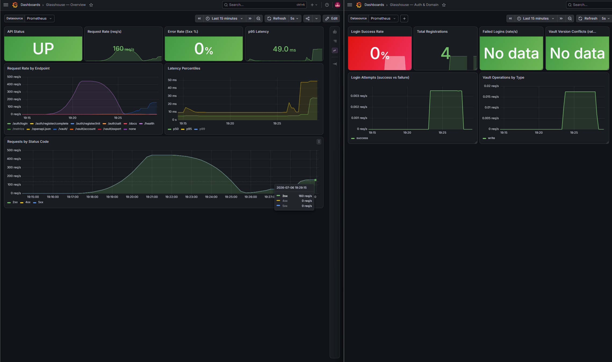
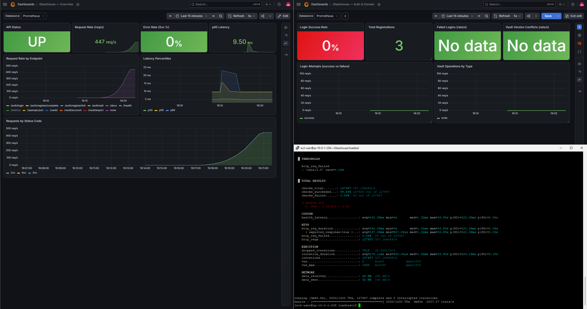
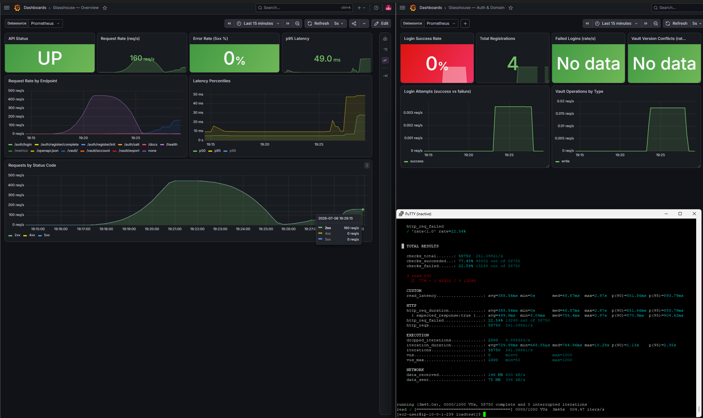

# Glasshouse

Glasshouse is an instantly cloneable zero knowledge password manager. It features a browser side cryptographic core, a fully async backend API, and a hardened IaC based deployment. The backend consists of a single cloud agnostic image that runs identically via `docker compose up` or on the Terraform provisioned AWS stack, similar to the one being used in the live demo deployment.

Glasshouse is one of the few self hostable password managers out there which open sources the entire deployment, including the application, IaC, CI/CD pipeline, and the live reference instance. The whole path to running your own production service is public and reproducible.

Note: The Live Demo is only hosted for throwaway and alt account credentials, and as a working demo for designing, coding, deploying, and operating a security critical service, and the project is not audited yet.

**Live demo:** https://passmanager.sudarshankaushik.com  ·  **API:** https://vault-api.sudarshankaushik.com

**Try it in one command:**

```bash
git clone https://github.com/awsomesud347/Glasshouse.git && cd Glasshouse
cp backend/.env.example backend/.env      # set PEPPER, JWT_SECRET (openssl rand -hex 32)
docker compose up
```

API comes up on `http://localhost:8000`; `curl localhost:8000/health` to confirm. Frontend setup is in [`docs/self-hosting.md`](docs/self-hosting.md). Full self-host config is below.

---

## How the zero-knowledge model works

The server never sees your master password or any plaintext credential.

1. Your master password runs through **Argon2id** (64 MB, 3 iterations) in the browser, with a per-user salt.
2. The result is split via **HKDF** into two keys:
   - an **encryption key** that never leaves the browser (non-extractable), encrypting your vault with **AES-256-GCM**, and
   - an **auth key** sent to the server only to prove identity.
3. The server never stores the auth key — it stores a **verifier**: the auth key peppered and hashed with Argon2 (`argon2-cffi`).
4. Your vault is one **encrypted blob** plus an IV and a version number. To the server it is opaque bytes.

Forget your master password and the vault is unrecoverable — no reset, because the server has nothing to reset to.

The crypto is implemented from primitives, not handed to a library that hides the decisions. The two-key split is the crux: the key that authenticates and the key that decrypts must be cryptographically unrelated, or the server would hold material related to the decryption key. HKDF with distinct `info` parameters produces two independent keys from one high-entropy Argon2 output. Every such choice — two keys, a fixed HKDF salt, a peppered verifier — is made and defended in [`docs/architecture.md`](docs/architecture.md).

## Architecture

```
Browser (all crypto; keys in memory only)
   │  HTTPS
   ▼
Cloudflare  ── DDoS, TLS, origin hidden
   │  HTTPS (origin cert; EC2 security group locked to Cloudflare IP ranges)
   ▼
nginx (reverse proxy)  ── TLS termination, rate limiting, /metrics access-controlled
   │  Docker network
   ▼
FastAPI (async API)  ── reads secrets from env; never published to the host
   │  SSL
   ▼
PostgreSQL
   ├─ self-host: containerized Postgres (docker compose)
   └─ production: AWS RDS in a private subnet, reachable only from the API security group
```

Secrets (pepper, JWT secret, database URL) live in **AWS Secrets Manager**, fetched via an **EC2 IAM role** scoped to exactly those secret ARNs, injected as environment variables at deploy time. The application makes no cloud API calls — for a self-hoster, those same values are just environment variables.

Full design and rationale: [`docs/architecture.md`](docs/architecture.md). What it protects against and what it doesn't: [`THREAT_MODEL.md`](THREAT_MODEL.md).

## Engineering highlights

- **Zero-knowledge crypto from primitives** — Argon2id, HKDF domain-separated split, AES-256-GCM, non-extractable browser key, peppered Argon2 verifier. A full database compromise yields ciphertext and verifiers that decrypt nothing.
- **Fully async backend** — FastAPI, async SQLAlchemy, asyncpg, no blocking calls in the request path. A single `t3.micro` sustains 588 req/s on the health path and ~260 req/s on DB-backed reads (see [Load testing](#load-testing--capacity)).
- **Optimistic concurrency control** — vault writes are version-checked with compare-and-set; concurrent multi-device edits are rejected (`409`) rather than silently clobbered, without the server ever seeing vault structure.
- **Cloud-agnostic by construction** — one `get_secret()` seam and env-var config, zero cloud SDK calls in application logic. The same image runs on a homelab box or the AWS stack; swapping RDS for a Postgres container is one environment variable.
- **Keyless, no-SSH CI/CD** — GitHub Actions authenticates to AWS via OIDC (no stored keys) and deploys over Systems Manager (no inbound SSH), gated by secret, dependency, and image scanning.

## Tech stack

**Application:** Python, FastAPI (async), Pydantic, SQLAlchemy (async), asyncpg, React + Vite, WebCrypto, Argon2id (hash-wasm / argon2-cffi), AES-256-GCM.

**Infrastructure & delivery:** Docker, AWS (EC2, RDS, ECR, Secrets Manager, IAM, VPC, SSM), Terraform, nginx, Cloudflare, Vercel, GitHub Actions (OIDC), Prometheus, Grafana, k6.

## CI/CD

Every push to `main` runs a security-gated GitHub Actions pipeline.

**CI:** secret scanning (gitleaks), dependency-vulnerability audit (pip-audit), Docker build, container-image scan (Trivy). A finding blocks the merge.

**CD:** on green CI, the pipeline authenticates to AWS via **OIDC** (no stored keys), pushes a commit-SHA-tagged image to ECR, and deploys over **Systems Manager** (no inbound SSH, no runner-IP allowlisting), then health-checks the live service. SHA tags make every running container traceable to its commit.

OIDC removes long-lived cloud credentials from the pipeline; SSM removes the open SSH port a "store a key, SSH in and pull" pipeline would need. Both cut standing attack surface.

## Observability

Prometheus metrics (`prometheus-fastapi-instrumentator`) plus custom domain counters — login success/failure, registrations, vault operations, version conflicts — at an access-controlled `/metrics`. Grafana dashboards, provisioned as code, cover request rate, error rate, latency percentiles, and the domain metrics.

Monitoring runs on a **dedicated on-demand instance** with its own standalone Terraform config, scraping over the private VPC and torn down when idle — decoupled from the workload it watches, at near-zero cost.



## Load testing & capacity

Load-tested with **k6** from a dedicated in-region EC2 generator, hitting the origin directly (Cloudflare bypassed) to measure true origin capacity. Server-side latency from Prometheus; instance and DB metrics from CloudWatch.

**Single `t3.micro` (2 vCPU, 1 GB):**

| Workload | Sustained | Errors | Server-side latency | Limiting factor |
|----------|-----------|--------|--------------------|-----------------|
| `/health` (no DB) | **588 req/s** | 0% | ~1.3 ms median | Load generator, not the app (app CPU ~17%) |
| Vault reads (DB-backed) | **~260 req/s** | onset of connection-shedding beyond | ~5 ms median query | Single-worker web tier |




The health path barely loaded the box — 588 req/s at ~17% CPU, ceiling set by the generator, not the server. On DB-backed reads, throughput held near 260 req/s before the origin shed connections — with the **database near-idle** (peak ~8 of ~80 connections) and query latency at ~5 ms. The bottleneck is web-tier connection handling — a single nginx worker and a single Uvicorn worker — not compute and not the database.

That is efficient (sub-10 ms server-side latency, an idle DB, hundreds of req/s from one small instance) and deliberately un-scaled. The read ceiling is a configuration limit, not an architectural wall: `worker_processes auto` and multiple Uvicorn workers raise it on the same instance, and the stateless API scales horizontally behind a load balancer after that. For its scope it handles thousands of concurrent users at realistic request rates, and the next tier is a config change, not a rewrite.

*(These figures characterize this instance size — not a benchmark against other products, whose numbers ride on different hardware and workloads.)*

## Self-hosting configuration

`docker compose up` (above) brings up the API and a Postgres container. Set these in `backend/.env`:

| Variable          | Purpose                                              |
|-------------------|------------------------------------------------------|
| `DATABASE_URL`    | PostgreSQL connection string (compose default works) |
| `PEPPER`          | Server-side pepper for the auth-key verifier         |
| `JWT_SECRET`      | Secret for signing session JWTs                      |
| `ALLOWED_ORIGINS` | Comma-separated allowed frontend origins             |

Self-hosters set these by hand; the production instance injects them from AWS Secrets Manager. Same application either way. Full guide: [`docs/self-hosting.md`](docs/self-hosting.md).

> **HTTPS required:** WebCrypto needs a secure context. `localhost` counts for development, but any networked deployment must serve frontend **and** API over HTTPS or key derivation won't run.

## Deployment targets

- **Run anywhere (Docker Compose):** API + containerized Postgres, no cloud dependency — [`docs/self-hosting.md`](docs/self-hosting.md).
- **AWS reference deployment:** the live instance — Terraform, managed RDS, Secrets Manager, Cloudflare, CI/CD, observability — [`docs/deployment.md`](docs/deployment.md).

The only difference is where the database and secrets come from, controlled entirely by environment variables. Production swaps the Postgres container for RDS by changing `DATABASE_URL`; the application code does not change.

## API

| Method | Path                      | Purpose                                          |
|--------|---------------------------|--------------------------------------------------|
| POST   | `/auth/register/init`     | Begin registration; returns salt and KDF params  |
| POST   | `/auth/register/complete` | Complete registration; stores verifier and vault |
| GET    | `/auth/salt`              | Fetch salt + KDF params for login                |
| POST   | `/auth/login`             | Authenticate; returns JWT and encrypted vault    |
| GET    | `/vault/`                 | Fetch the encrypted vault blob                    |
| PUT    | `/vault/`                 | Update the vault (optimistic-locked by version)  |
| GET    | `/vault/export`           | Export encrypted vault for portability           |
| DELETE | `/vault/account`          | Delete the account and all stored data           |
| GET    | `/health`                 | Health check                                      |

## Shipped / next

**Shipped:** cloud-agnostic application; client-side zero-knowledge crypto; Terraform AWS + Vercel reference deployment (least-privilege IAM, Secrets Manager); security-gated CI/CD (OIDC, SSM); observability (Prometheus + Grafana as code, decoupled on-demand monitoring).

**Next:** MFA (interacts non-trivially with the zero-knowledge login flow — scoped, not half-built); first-class Terraform for other clouds and a bare-metal path; a public read-only Grafana dashboard; Terraform remote state (S3 + locking) so the pipeline can manage infrastructure, not just deploy the app.

## Known limitations

Deliberate scope decisions, documented not hidden — concerning the security and operational posture as much as the code. Detail in [`THREAT_MODEL.md`](THREAT_MODEL.md).

- **No MFA yet** — interacts non-trivially with the zero-knowledge login flow; scoped rather than half-implemented.
- **No third-party audit.**
- **Single-blob vault, conflict-detecting not merging** — concurrent two-device edits are detected (409), not merged; a direct consequence of the server not seeing entry structure.
- **In-memory rate limiting** — resets on restart, not shared across instances; production fix is a shared (Redis-backed) limiter.
- **Deploy-time secret injection** — secrets enter the process environment at deploy rather than runtime fetch; caching runtime fetch is noted as an enhancement.
- **Free-tier backup retention** — automated RDS backups on; retention constrained by the account plan.

## License

MIT — see [`LICENSE`](LICENSE).